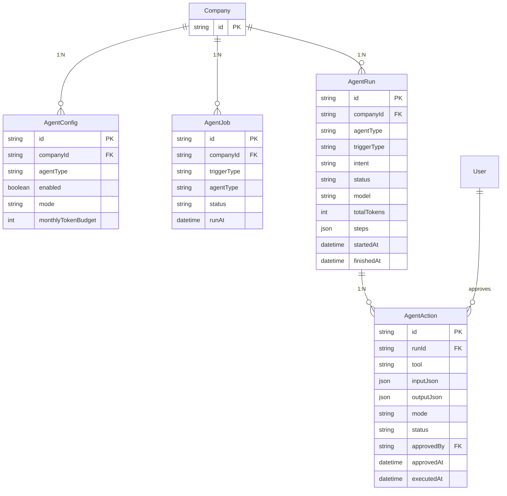

# ERD — Skema Data AgentOps (tambahan ke `packages/db/prisma/schema.prisma`)

Dokumen ini berisi model Prisma baru yang ditambahkan di samping skema existing
(User, Company, Freelancer, Contract, Timesheet, Invoice, Payment, ComplianceRecord,
AuditLog, Notification) agar AI Agents memiliki: antrian kerja, jejak run, daftar aksi
dengan persetujuan, dan konfigurasi per perusahaan.

## 1. Diagram ER



## 2. Kode Prisma (tambahan ke schema.prisma)

```prisma
// ─────────────────────────────────────────────────────────────
// AI AGENTS — JOB, RUN, ACTION, CONFIG
// ─────────────────────────────────────────────────────────────

enum AgentType {
  BILLING
  COMPLIANCE
  OPS_COPILOT
  GENERAL
}

enum AgentTrigger {
  TIMESHEET_APPROVED
  INVOICE_STATUS_CHANGED
  COMPLIANCE_UPDATED
  CRON_DAILY
  CRON_WEEKLY
  USER_CHAT
}

enum AgentJobStatus {
  PENDING
  LOCKED
  PROCESSED
  FAILED
}

enum AgentRunStatus {
  QUEUED
  RUNNING
  SUCCEEDED
  FAILED
  NEEDS_REVIEW
}

enum AgentActionMode {
  PROPOSE
  AUTO
}

enum AgentActionStatus {
  PENDING
  APPROVED
  REJECTED
  AUTO_EXECUTED
  EXPIRED
  FAILED
}

/// Antrian kerja agent (event & cron) berbasis DB.
model AgentJob {
  id           String        @id @default(cuid())
  companyId    String
  agentType    AgentType
  triggerType  AgentTrigger
  status       AgentJobStatus @default(PENDING)
  runAt        DateTime      @default(now())
  attempts     Int           @default(0)
  error        String?       @db.Text
  createdAt    DateTime      @default(now())

  company Company @relation(fields: [companyId], references: [id], onDelete: Cascade)

  @@index([status, runAt])
  @@index([companyId])
  @@map("agent_jobs")
}

/// Satu eksekusi orchestrator (ReAct loop). Semua jejak di sini.
model AgentRun {
  id          String         @id @default(cuid())
  companyId   String
  agentType   AgentType
  triggerType AgentTrigger
  intent      String?
  status      AgentRunStatus @default(QUEUED)
  model       String?
  totalTokens Int            @default(0)
  steps       Json           @default("[]")
  error       String?        @db.Text
  startedAt   DateTime       @default(now())
  finishedAt  DateTime?

  company Company @relation(fields: [companyId], references: [id], onDelete: Cascade)
  actions AgentAction[]

  @@index([companyId, startedAt])
  @@map("agent_runs")
}

/// Aksi yang diputuskan agent: menunggu approve (`PROPOSE`) atau langsung (`AUTO`).
model AgentAction {
  id         String            @id @default(cuid())
  runId      String
  tool       String
  input      Json
  mode       AgentActionMode   @default(PROPOSE)
  status     AgentActionStatus @default(PENDING)
  idempotencyKey String?       // kunci unik anti-duplikat (guard)
  reason     String?           @db.Text
  approvedBy String?
  approvedAt DateTime?
  output     Json?
  error      String?           @db.Text
  createdAt  DateTime          @default(now())
  executedAt DateTime?

  run       AgentRun @relation(fields: [runId], references: [id], onDelete: Cascade)
  approver  User?    @relation("AgentActionApprover", fields: [approvedBy], references: [id], onDelete: SetNull)

  @@index([status, createdAt])
  @@index([runId])
  @@map("agent_actions")
}

/// Konfigurasi agent per perusahaan (diubah hanya oleh OWNER/ADMIN).
model AgentConfig {
  id             String          @id @default(cuid())
  companyId      String
  agentType      AgentType
  enabled        Boolean         @default(true)
  mode           AgentActionMode @default(PROPOSE)   // default mode untuk semua tool
  toolOverrides  Json            @default("{}")      // {"createDraftInvoice": "AUTO"}
  autoActionThreshold Float?                         // batas nilai aksi yang boleh AUTO (mis. 10000)
  monthlyTokenBudget Int         @default(100000)
  createdAt      DateTime        @default(now())
  updatedAt      DateTime        @updatedAt

  company Company @relation(fields: [companyId], references: [id], onDelete: Cascade)

  @@unique([companyId, agentType])
  @@map("agent_configs")
}

/// Embedding untuk RAG (pgvector). Di-join ke Freelancer/Invoice/
/// doc text (generik agar bisa reuse).
model AgentEmbedding {
  id        String  @id @default(cuid())
  companyId String
  entity    String   // "freelancer" | "invoice" | "compliance" | "document-text"
  entityId  String
  content   String   @db.Text
  vector    Unsupported("vector(384)")?  // sesuaikan dimensi embedding provider
  createdAt DateTime @default(now())

  company Company @relation(fields: [companyId], references: [id], onDelete: Cascade)

  @@index([companyId, entity, entityId])
  @@map("agent_embeddings")
}
```

Catatan relasi tambahan pada model `Company` dan `User`:

```prisma
model Company {
  // ... existing fields
  agentConfigs AgentConfig[]
  agentJobs    AgentJob[]
  agentRuns    AgentRun[]
  agentEmbeddings AgentEmbedding[]
}

model User {
  // ... existing fields
  approvedAgentActions AgentAction[] @relation("AgentActionApprover")
}
```

## 3. Penjelasan Model

### Model `AgentJob`

- Antrian berbasis DB (ADR-002). Diisi oleh: mutation tRPC (event sinkron, di luar
  transaksi utama) dan `pg_cron` (trigger harian/mingguan).
- Worker menandai `LOCKED` (advisory lock per `companyId`), memproses, lalu update ke
  `PROCESSED`/`FAILED`. `attempts` untuk retry backoff.

### Model `AgentRun`

- Satu baris per eksekusi loop. `steps` (JSON array) menyimpan trace: setiap iterasi,
  dokumen tool, reasoning, token. Ini sumber observability & bahan eval.
- `NEEDS_REVIEW` artinya kondisi tak normal (contoh: guard tolak semua aksi) — butuh
  konfirmasi admin, bukan error diam-diam.

### Model `AgentAction`

- Perekam semua tindakan yang diputuskan agent. `mode PROPOSE` → menunggu `APPROVED`.
  `AUTO` → langsung `AUTO_EXECUTED` (hanya aksi non-finansial).
- `approvedBy` = actor user; disimpan juga `reason` untuk reject.
- Aksi yang stale (menunggu > 7 hari / kondisi berubah) → `EXPIRED`.

### Model `AgentConfig`

- Per (company, agentType). `mode` default PROPOSE (ADR-005); `toolOverrides` JSON untuk
  meng-override satu tool ke AUTO (contoh: `sendReminderEmail: "AUTO"`).
- `autoActionThreshold` — batas nilai aksi finansial yang boleh berjalan `AUTO`; jika
  melebihi batas meski config `AUTO`, aksi tetap dipaksa `PROPOSE`.

### Model `AgentEmbedding`

- Table pgvector untuk RAG Copilot. `content` = teks chunk (freelancer profile, contract
  terms, invoice item, doc compliance). Vector type menyesuaikan provider embedding
  (Gemini `text-embedding-004` = 768 dim; sesuaikan di migration).

## 4. Integrasi dengan Entitas Existing

- `AuditLog`: agent menulis `action: "AGENT_<TOOL>"`, `userId: null`,
  `metadata: { actorType: "AGENT", runId, actionId }` → jejak audit tetap utuh tanpa
  mengubah skema AuditLog.
- `Notification`: digunakan untuk memberitahu user (approval menunggu, run gagal,
  pengingat) — existing `Notification` table langsung dipakai.
- `Invoice.create`, `ComplianceRecord.update`, `Timesheet.block` — dibungkus tool; mapping
  tool → mutasi tRPC existing, TANPA menambah kolom status baru di tabel existing
  (kecuali dibutuhkan di phase lanjut, contoh: `Invoice.agentDrafted Boolean?`).

## 5. Migrasi & Catatan Implementasi

1. Tambahkan blok Prisma di atas ke `packages/db/prisma/schema.prisma`, jalankan
   `pnpm db:push` (dev) lalu `pnpm db:generate`.
2. Aktifkan extension: `CREATE EXTENSION IF NOT EXISTS vector;` pada Supabase dev
   (jika AgentEmbedding dipakai di MVP — bisa ditangguhkan ke phase Copilot chat).
3. Seed: buat `AgentConfig` default per company saat company dibuat (watch helper),
   dengan `mode: PROPOSE`, semua agent `enabled: true`.
4. Tanam contoh action pada seed untuk demontrasi queue & activity.
